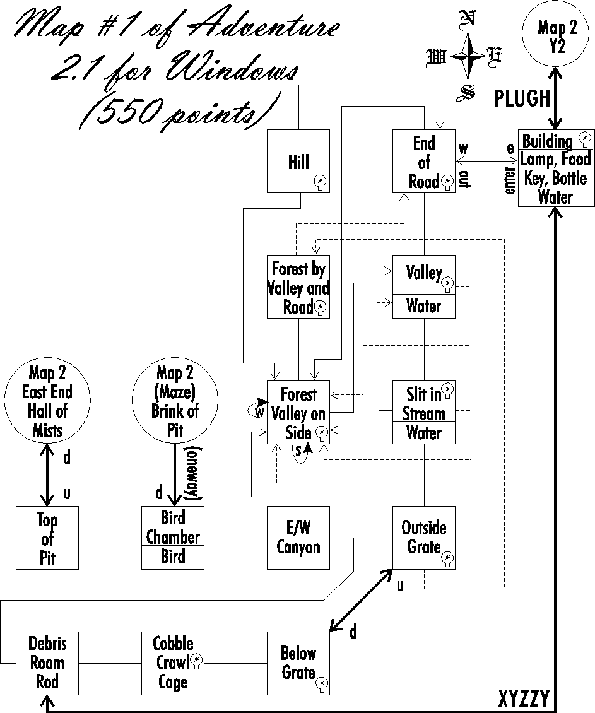
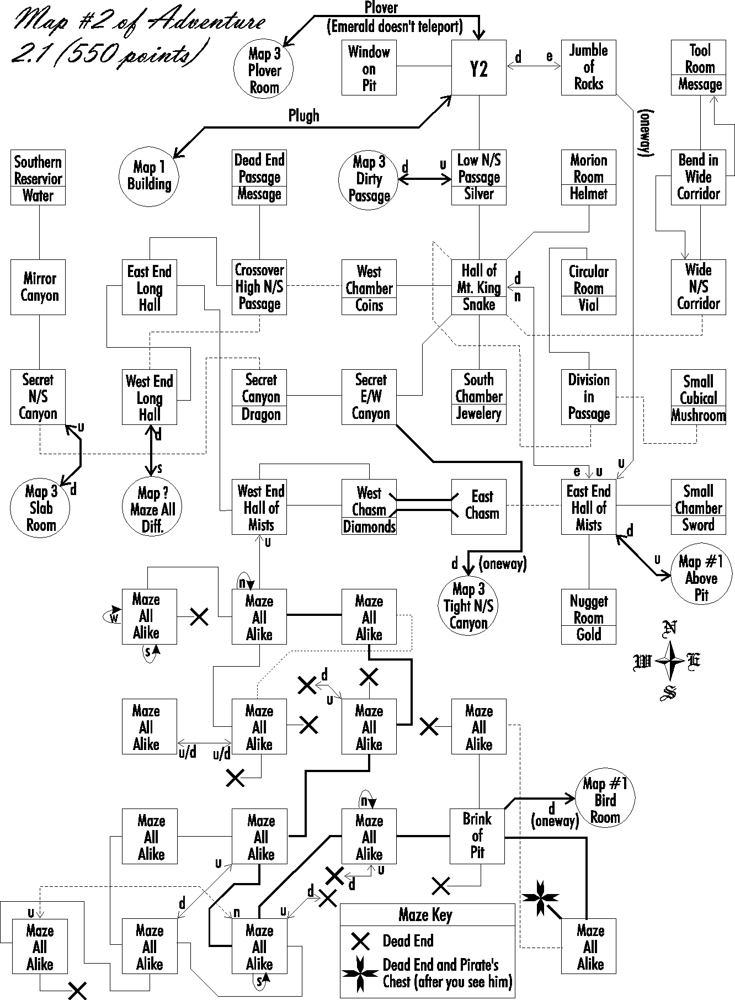
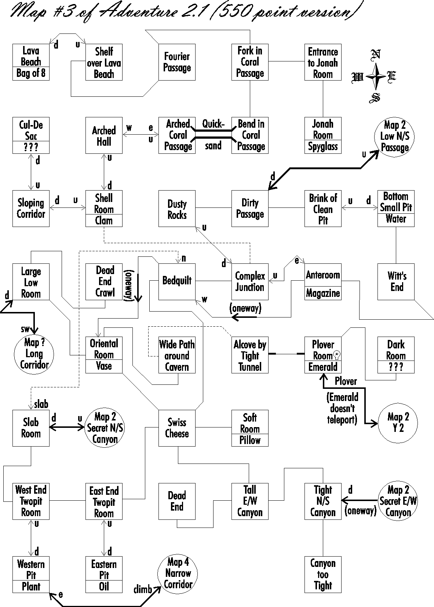

# Colossal Cave Adventure

This document summarizes the map images found in the `maps` directory and provides a single Mermaid overview of how the major regions connect.

## Images Found in maps/

1. `adv2-1.gif` - Map 1 (surface and early cave)
2. `adv2-2.gif` - Map 2 (main cave, halls, chasms, and maze regions)
3. `adv2-3.gif` - Map 3 (deeper cave, pits, coral passages, and canyon links)

## Unified Mermaid Overview

```mermaid
flowchart TD
  %% Map 1 anchors
  Road[End of Road]
  Building[Building]
  Valley[Valley]
  OutsideGrate[Outside Grate]
  BelowGrate[Below Grate]
  BirdRoom1[Bird Chamber]
  TopPit[Top of Pit]

  %% Map 2 anchors
  Y2[Y2]
  LowNS[Low N/S Passage]
  HallKing[Hall of Mt. King]
  EastHall[East End Hall of Mists]
  WestHall[West End Hall of Mists]
  Maze2[Maze Region (Map 2)]
  Brink2[Brink of Pit]

  %% Map 3 anchors
  Dirty[Dirty Passage]
  BrinkClean[Brink of Clean Pit]
  BottomSmall[Bottom Small Pit]
  Complex[Complex Junction]
  Bedquilt[Bedquilt]
  Oriental[Oriental Room]
  Alcove[Alcove by Tight Tunnel]
  Plover3[Plover Room]
  Slab3[Slab Room]
  TightNS3[Tight N/S Canyon]
  TwopitW[West End Twopit]
  TwopitE[East End Twopit]

  %% Core local links
  Road --> Building
  Road --> Valley
  Valley --> OutsideGrate
  OutsideGrate --> BelowGrate
  BelowGrate --> BirdRoom1
  BirdRoom1 --> TopPit

  Y2 --> LowNS
  LowNS --> Y2
  LowNS --> HallKing
  HallKing --> EastHall
  HallKing --> WestHall
  WestHall --> Maze2
  Maze2 --> Brink2

  Dirty --> BrinkClean
  BrinkClean --> BottomSmall
  BottomSmall --> BrinkClean
  Dirty --> Complex
  Complex --> Bedquilt
  Bedquilt --> Oriental
  Oriental --> Alcove
  Alcove --> Plover3
  Slab3 --> TwopitW
  TwopitW --> Slab3
  TwopitW --> TwopitE
  TwopitE --> TwopitW

  %% Cross-map connectors shown on map sheets
  Building -->|PLUGH| Y2
  TopPit -->|to Map 2 East Hall| EastHall
  BirdRoom1 -->|one-way from Brink| Brink2
  LowNS --> Dirty
  Dirty --> LowNS
  Slab3 --> HallKing
  HallKing --> Slab3
  TightNS3 -->|one-way| EastHall
  Plover3 --> Y2
  Y2 --> Plover3
```

## Textual Description of Each Image

### adv2-1.gif (Map 1)



This sheet shows the opening surface loop and first cave descent. The main flow starts at End of Road and Building, then branches through Hill, Valley, Slit in Stream, and Outside Grate into Below Grate. From there the map reaches Cobble Crawl, Debris Room, and Bird Chamber. It also marks transitions toward later maps, including links to Map 2 at Y2, East End Hall of Mists, and the Bird/Brink connection.

### adv2-2.gif (Map 2)



This sheet is the central cave hub. It places Y2, Hall of Mt. King, East/West Hall of Mists, chasms, circular/division corridors, and several item rooms in one connected region. It also documents extensive maze blocks and one-way arrows, including the route from Brink of Pit toward the Map 1 Bird Room. Cross-map jump points to Map 1 and Map 3 are clearly annotated (PLUGH, Dirty Passage, Slab Room, Plover Room).

### adv2-3.gif (Map 3)



This sheet covers deeper cave structure and canyon systems. It connects Dirty Passage to Brink of Clean Pit and Bottom Small Pit, then spreads into Complex Junction, Bedquilt, Oriental Room, Swiss Cheese, and Alcove/Plover areas. It also includes Twopit rooms, Tight N/S and Tall E/W canyon paths, and additional onward links (including Map 4 reference). Cross-map portals back to Map 2 are marked at Low N/S Passage, Secret N/S Canyon, Secret E/W Canyon, and Y2 via the Plover route.
