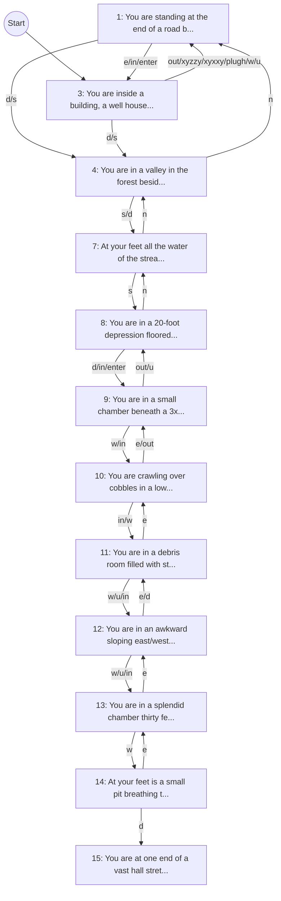

# Discovered Adventure Graph

## Notes

- Graph reflects deterministic probes from a fresh process each time.
- Bootstrap commands: no, enter, take lamp, take keys, on, out.
- Candidate commands are prioritized from look context.
- Magic words (xyzzy/xyxxy/plugh) are included in probing.
- Increase --max-hops for broader exploration (runtime grows quickly).
