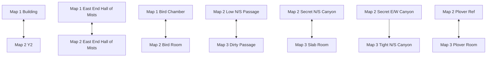
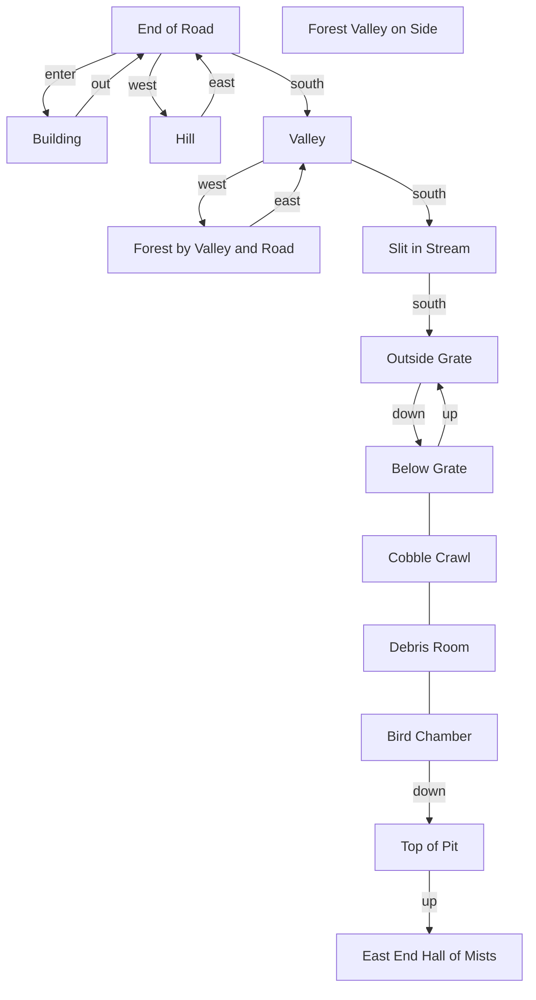
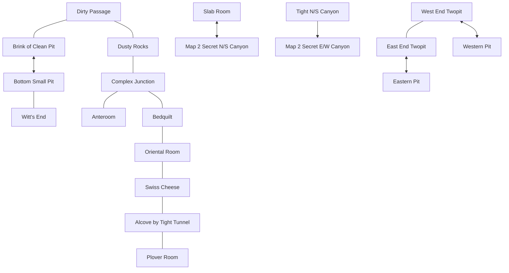

# Adventure 2.7 Map Model (Mermaid)

This document is a textual map model derived from the image maps in this folder.
It is intended to support deterministic route-based regression tests.

> **Viewing Mermaid Diagrams:**  
> Visual Studio's built-in Markdown preview does not render Mermaid diagrams. Options:
> - **GitHub**: View this file on GitHub for automatic Mermaid rendering
> - **VS Code**: Install [Markdown Preview Mermaid Support](https://marketplace.visualstudio.com/items?itemName=bierner.markdown-mermaid)
> - **Online**: Copy diagram code to [mermaid.live](https://mermaid.live/)
> - **Alternative**: See GIF maps in the `maps/` directory

## Scope and Modeling Notes

- This model captures major rooms and explicit labeled links from map sheets 1-3.
- Dense maze regions are intentionally abstracted into grouped nodes.
- Cross-map connectors are represented as named portal nodes.

## Global Cross-Map Graph



## Map 1 (Surface and Early Cave)



## Map 2 (Main Cave, Halls, Chasms, Mazes)

```mermaid
flowchart TD
  Y2[Y2]
  Jumble[Jumble of Rocks]
  LowNS[Low N/S Passage]
  HallKing[Hall of Mt. King]
  SouthChamber[South Chamber]
  WestChamber[West Chamber]
  Circular[Circular Room]
  Division[Division in Passage]
  EastHall[East End Hall of Mists]
  WestHall[West End Hall of Mists]
  WestChasm[West Chasm]
  EastChasm[East Chasm]
  WideNS[Wide N/S Corridor]
  SmallCubical[Small Cubical]
  SmallChamber[Small Chamber]
  Nugget[Nugget Room]
  MazeCore[Maze Region (abstracted)]
  Brink[Brink of Pit]
  BirdRoom[Bird Room]

  Y2 <--> Jumble
  Y2 --- LowNS
  LowNS --- HallKing
  HallKing --- SouthChamber
  HallKing --- WestChamber
  HallKing --- Circular
  Circular --- Division
  Division --- EastHall
  EastHall --- Nugget
  EastHall --- SmallChamber
  Division --- WideNS
  WideNS --- SmallCubical
  WestHall --- WestChasm
  EastChasm --- EastHall
  WestChasm --- EastChasm
  WestHall --- MazeCore
  MazeCore --- Brink
  Brink --> BirdRoom
```

## Map 3 (Deep Cave and Canyon Links)



## Route Used for Regression

The regression test smoke.map1_surface_route follows this Map 1 route:

1. End of Road -> Building (enter)
2. Building -> End of Road (out)
3. End of Road -> Hill (west)
4. Hill -> End of Road/front of building (east)

This route verifies stable movement semantics across a small, map-backed cycle.
